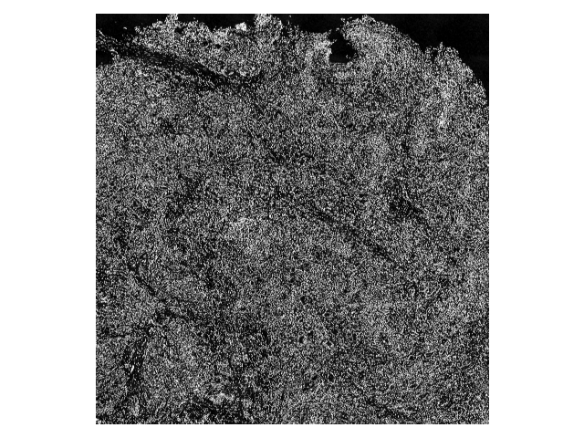
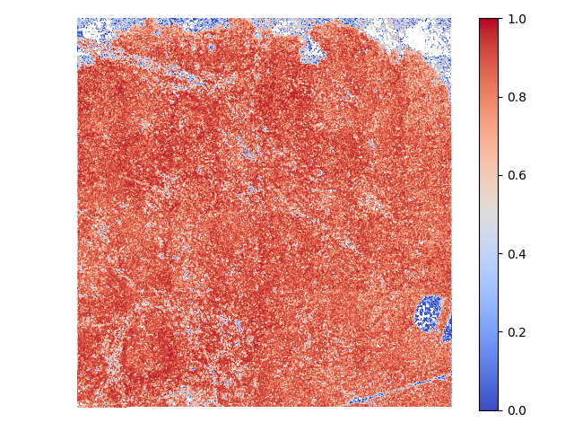

# Blockwise
Fast blockwise operations of array data
## Rationale
Image registration is crucial for comparing/integrating images with spatial correspondence but don't exactly align due to complications like specimen deformation (ex. histological images) or optical distortion. There has been a thriving effort to develop powerful non-rigid image registrations (ex. [ANHIR](https://ieeexplore.ieee.org/document/9058666)), yet from an end user's perspective, the very first question is not "which algorithm to use" but rather:

> Do I need to register this particular dataset?

One quick and intuitive way to check it is to calculate the correlation coefficient. However, calculating one coefficient for the entir image does not capture local heterogeneity if the image is large (ex. 10k-by-10k pixels). A better way is to calculate one coefficient for each smaller regions (ex. [for each single cell](https://github.com/hungyiwu/tissue_integrity_dashboard)).

| Image 1 | Image 2 | Corr. coef. heatmap |
|---------|---------|---------------------|
||||

However, this imposes a software engineering challenge: tasks are so small (`np.corrcoef` for two 10x10 arrays) that communication overhead roughly cancels parallelization speedup.

```
# output from demo_performance.py
arr1: (10100, 9660), arr2: (10100, 9660), block shape: (10, 10)
straightforward, 1 process: 80.635 sec
straightforward, 4 processes: 85.913 sec
```

`blockwise` aims to perform blockwise operations (sum, mean, standard deviation, Pearson correlation coefficient) faster by replacing loops with vectorized operations. It's inspired by `skimage.feature.match_template` source code and [related discussion](https://github.com/dask/dask-image/pull/148#discussion_r444649473). 

```
# output from demo_performance.py
blockwise, 1 process: 15.179 sec
```

The example images shown above are 185 MB each (uint16). The next ones are 505 MB (uint16) each, which the `blockwise` approach wouldn't be possible on a 16 GB RAM machine without `dask.array` (also the free parallelization!):

```
# output from demo_performance.py
arr1: (16120, 16840), arr2: (16120, 16840), block shape: (10, 10)
straightforward, 1 process: 249.948 sec
straightforward, 8 processes: 275.425 sec
blockwise, 8 process: 41.308 sec
```
